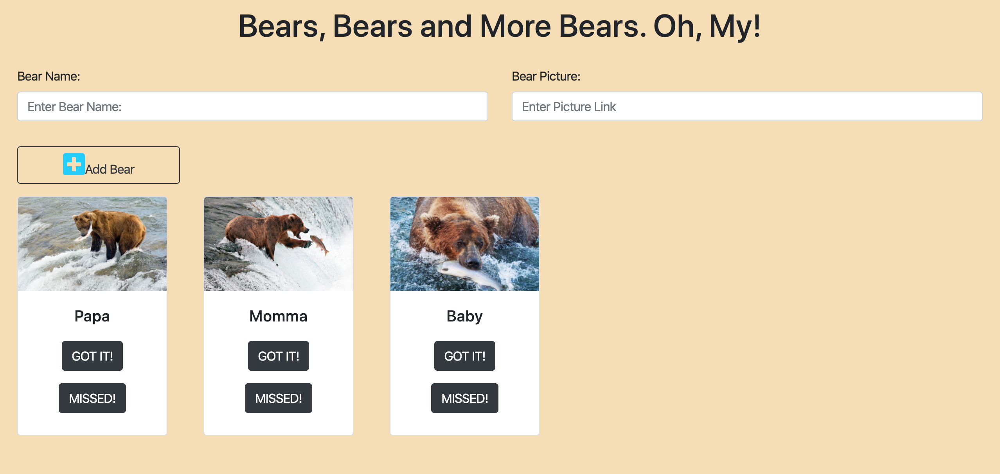

# Bear Watcher

## Description
A site that allows the user to enter a bear name and an image to be tracked. Once the information is submitted, the information is added to a bootstrap card below the input form for further tracking of each bear added.  There is also a button for tracking the bears fishing: one for missed attempts, and one for "got it" when they caught the fish.

## Screenshots
Home Page

## How to Run
1. Clone this repo
1. Make sure you have http-server installed via npm. If not get it [here](https://www.npmjs.com/package/http-server)
1. On your command line, run `hs -p 9999`
1. In your browser, go to `http://localhost:9999`
